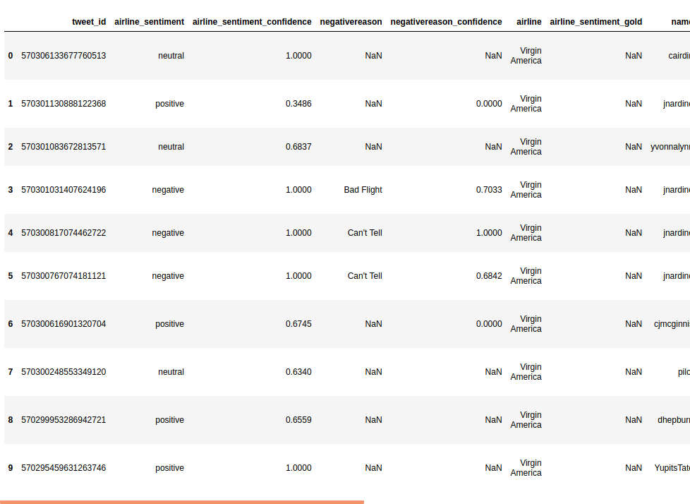
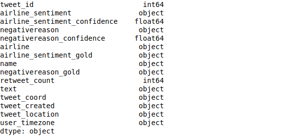

# Introduction to Pandas for NLP
Pandas is an open-source library that is made mainly for working with relational or labeled data both easily and intuitively. The library provides easy access to 
different functions for cleaning and processing data for any purpose. This library is built on the top of the NumPy library. Pandas is fast and it has high-performance & productivity for users.
Pandas is especially useful in different Machine Learning fields and it's applications are not limited to manipulating numerical data. It is also extremely useful in manipulating textual data, something that comes in handy when working in NLP

## Key Features of Pandas
* Fast and efficient DataFrame object with default and customized indexing.
* Tools for loading data into in-memory data objects from different file formats.
* Data alignment and integrated handling of missing data.
* Data alignment and integrated handling of missing data.
* Label-based slicing, indexing and subsetting of large data sets.
* Columns from a data structure can be deleted or inserted.
* Group by data for aggregation and transformations.
* High performance merging and joining of data.
* Easy handling and manipulation of textual data.

## Installing Pandas
Open the terminal and type the following command in:
```
pip3 install pandas
```
If pip is not already installed, you might meet an error message, if that happens use the following command in the terminal
```
sudo apt-get install python3-pip
```
## Getting Started
In this tutorial we will be starting from the basic operations that pandas allows and working our way upto some manipulation and inference techniques that are an absolute necessity for working in NLP
### Importing Pandas and Reading CSV Files

```python
import pandas as pd
```
We willbe using a csv file named Tweets.csv to show the different applications of pandas in NLP. To load the csv file:
```python
data = pd.read_csv("Tweets.csv")
```
This loads the csv file in the variable 'data' as a dataframe.
## Data Information
To effectively use the functions at our disposal, we need to know everything about the data that we are going to be manipulating, pandas provides an array of different functions for this purpose.
### .head() method
To simply view the dataframe:
```python
data.head(10)
```
The output looks something like this:

This provides a birds-eye view of the whole dataset and can be used at any stage of data cleaning/manipulation to get a sense of how the changes you are making are affecting the whole dataframe.
### .shape method
To get the number of rows and columns in DataFrame, we use the shape method:
```python
data.shape 
```
The output shows that the DataFrame has 14640 rows and 15 columns:


### .info() method
This method is used to get a summary about the whole DataFrame in an easy to read manner:
```python
data.info() 
```
The output shows the summary of the whole DataFrame:


### .dtypes method
This method is used to specifically find out the data type of the values in each columns:
```python
data.dtypes
```
The output displays all the datatypes in the DataFrame:


